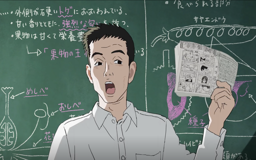
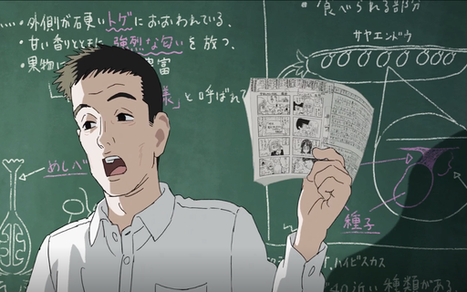
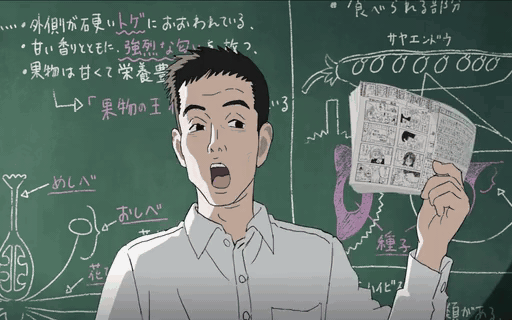
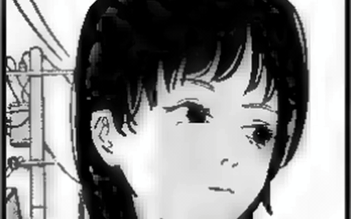
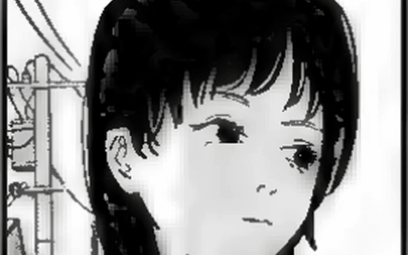
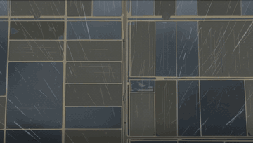

# Manimate

A manga-to-animation pipeline: sparse hand-drawn keyframes become smooth 24fps animation via diffusion-based frame interpolation, backed by a LoRA trained on the source manga's art style.

## Examples

**Keyframe pair → MoG-VFI interpolation (14 frames / pair @ 320×512)**

<p>
  
  
</p>



([full-quality MP4](assets/examples/result.mp4))

**Flat baseline vs. layer-separated composite** — same keyframe pair, two pipelines. The composite interpolates character and inpainted background independently, then recomposites. Holds character lines better through motion when the background is largely static.

| Flat (baseline) | Layer-separated composite |
| --- | --- |
|  |  |
| [MP4](assets/examples/baseline.mp4) | [MP4](assets/examples/composite.mp4) |

**LTX single-pass baseline** — text-to-video in one shot, for comparison against the keyframe-guided approach.



([full-quality MP4](assets/examples/ltx_single_pass.mp4))

## Modes

- **Mode A — Keyframe interpolation** *(working)*. Animator draws keyframes at variable spacing, AI fills the in-betweens.
- **Mode B — AI rotoscope** *(planned)*. Reference video → style-transferred keyframes (ControlNet + LoRA) → same interpolation pipeline as Mode A.

Both modes converge on the same downstream interpolation step.

## Quick Start

```bash
git clone --recurse-submodules https://github.com/not-matty/animation.git
cd animation
uv pip install -e ".[dev]"
python scripts/download_models.py      # ~10GB of weights
```

Interpolate a directory of keyframes (sorted lexicographically):

```bash
python scripts/interpolate.py keyframes=path/to/keyframes/ output=out.mp4
```

Override inference settings via Hydra syntax:

```bash
python scripts/interpolate.py keyframes=... output=... ddim_steps=25 half_precision=false
```

Base config: [`configs/interpolation/default.yaml`](configs/interpolation/default.yaml).

## Requirements

- Python 3.10+
- CUDA GPU (8GB VRAM with fp16; 20GB+ for full precision)
- ffmpeg

## Development

```bash
ruff check . && ruff format --check .
pyright
python -m pytest tests/ -x
```

See [`CLAUDE.md`](CLAUDE.md) for project conventions and [`RESEARCH-BRIEF.md`](RESEARCH-BRIEF.md) for the full design.

## License

MIT
